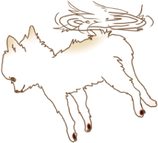

# jquery.img-bottom
テキストの右下に画像を回り込ませたい時にどうぞ

## 使い方
下記の用にimgタグにクラス等を指定して使います。
```
$('.img-bottom').imgBottom();
```

```
<p class="clearfix">ほげほげほげほげほげほげほげほげ
    ほげほげほげほげほげほげほげほげ
    ほげほげほげほげほげほげほげほげ
    ほげほげほげほげほげほげほげほげ
    ほげほげほげほげほげほげほげほげ
    ほげほげほげほげほげほげほげほげ
    ほげほげほげほげほげほげほげほげ
    ほげほげほげほげほげほげほげほげ
    ほげほげほげほげほげほげほげほげ
    ほげほげほげほげほげほげほげほげ
    ほげほげほげほげほげほげほげほげ
    ほげほげほげほげほげほげほげほげ
    ほげほげほげほげほげほげほげほげ
    ほげほげほげほげほげほげほげほげ
    ほげほげほげほげほげほげほげほげ
    ほげほげほげほげほげほげほげほげ
    ほげほげほげほげほげほげほげほげ
    ほげほげほげほげほげほげほげほげ
    ほげほげほげほげほげほげほげほげ
    ほげほげほげほげほげほげほげほげ</p>
```

下記のように画像が右下に回り込みます。
